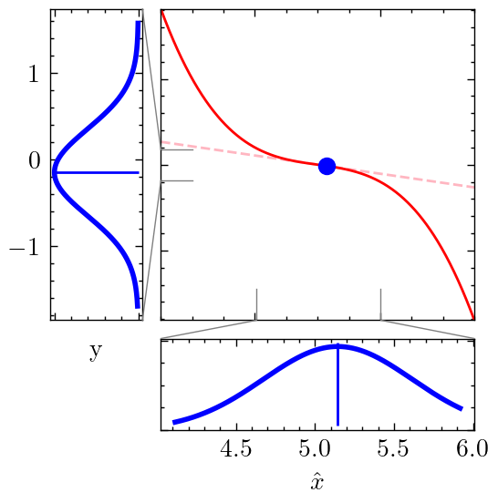
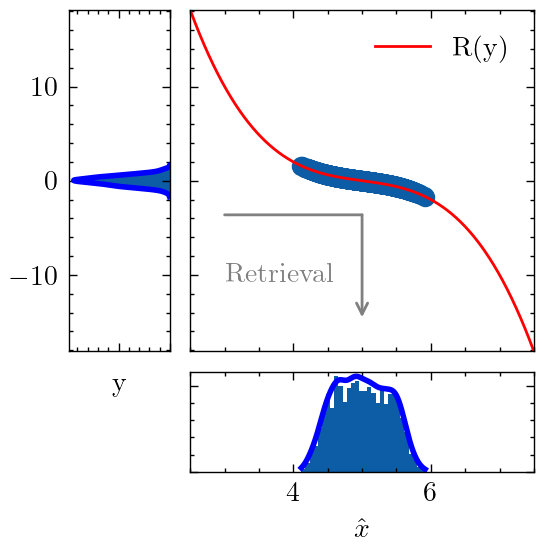
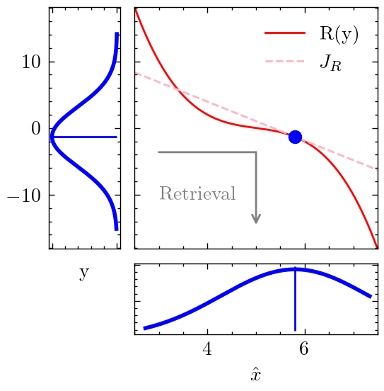
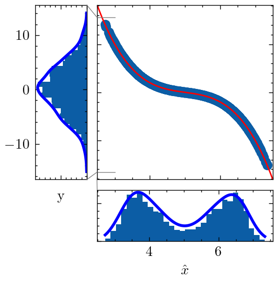

# Efficient Uncertainty Quantification for Iterative Tomographic Retrieval

[Poster](poster.pdf)
[Code](nonlinear_fit.py)

Key Ideas:
- [Delta method][1] is a simple/cheap way to obtain uncertainty estimates in inverse problems $`y=F(x) + \epsilon`$. $`\hat{x} = R(y) = \arg \min_x \|y - F(x)\|`$
- $`\Sigma_x \approx J_R \Sigma_y J_R^T`$
- Applicable when:
  - Noise $`\epsilon`$ is additive Gaussian
  - Noise level $`\Sigma_y`$ is "small" relative to curvature of $`R(y)`$
- Need [implicit function theorem][2] to approximate $`J_R`$ efficiently

[1]: https://arxiv.org/html/2502.14698v1#S1
[2]: https://implicit-layers-tutorial.org/implicit_functions/

## Uncertainty Quantification of $`\hat{x}`$

Below are numerical experiments of the delta method under different noise conditions (compared against Monte Carlo)

- Monte Carlo - accurate but expensive
- Delta Method - cheap but requires approximate linearity

|            | Delta Method (w/ IFT)                                  | Monte Carlo                                           | Notes                                              |
|------------|--------------------------------------------------------|-------------------------------------------------------|----------------------------------------------------|
| Low Noise  |  |  | - approximates Monte Carlo UQ well                 |
| High Noise |  |  | - unable to capture bimodality of $`P(\hat{X}|Y)`$ |
|            |                                                        |                                                       |                                              |     |

## Abstract

A primary goal for the Carruthers Geocorona Observatory (CGO) mission is to move beyond providing a single "best-fit" data product and instead deliver a full probabilistic characterization of the exosphere. This involves generating a map of expected errors, or uncertainties, for every voxel in the reconstructed density distribution, a key requirement for enabling rigorous scientific interpretation. Uncertainty quantification (UQ) is essential for distinguishing genuine physical features in the retrieved images from potential artifacts of the reconstruction process.

Traditional numerical methods for UQ, such as bootstrapping or Markov Chain Monte Carlo (MCMC), are computationally prohibitive for a high-dimensional problem like tomography, as they require running the full, expensive retrieval algorithm many thousands or millions of times.

To overcome this barrier, a novel and computationally efficient method for UQ is proposed. This approach combines the delta method, a statistical technique for propagating variance through a function, with the implicit function theorem. The delta method requires the Jacobian (the matrix of all first-order partial derivatives) of the retrieval algorithm. For a complex, iterative algorithm, computing this Jacobian by differentiating through every step of the optimization ("unrolling the loop") is computationally untenable. The proposed solution bypasses this by using the implicit function theorem to derive an analytical expression for the Jacobian that depends only on the derivatives of the objective function at the final, converged solution. This provides a pathway to efficiently approximate the diagonal of the covariance matrix of the retrieved density, which describes the uncertainty in each voxel.
